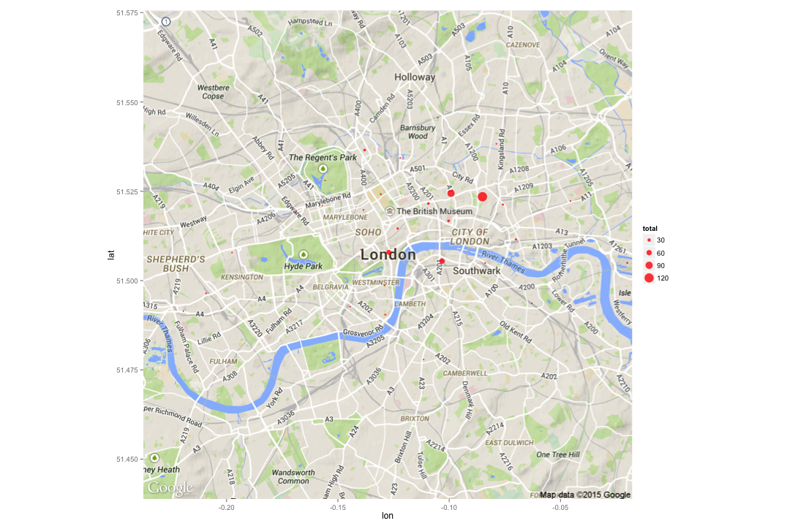

When do people go to meetups?
========================================================

The first thing we'll explore is when people go to meetups by day of week and month of year - starting simple!

Let's import the libraries we'll need:


```r
library(RNeo4j)
library(dplyr)
library(ggplot2)
library(gridExtra)
```

And setup our connection to Neo4j and define a function which we'll use to translate the timestamps we get from Neo4j into R Dates:


```r
timestampToDate <- function(x) as.POSIXct(x / 1000, origin="1970-01-01", tz = "GMT")
graph = startGraph("http://localhost:7474/db/data/")
options(width = 200)
```

This is the part of the graph that we're interested in:


Now we'll execute a query to get back the names of events, the date they were hosted and the number of people who RSVP'd 'yes' which we'll be using as a proxy for 'attended':


```r
query = "MATCH (g:Group)-[:HOSTED_EVENT]->(event)<-[:TO]-({response: 'yes'})<-[:RSVPD]-()
         WHERE (event.time + event.utc_offset) < timestamp()
         RETURN g.name, 
                event.time + event.utc_offset AS eventTime,
                event.name, 
                COUNT(*) AS rsvps"

events = cypher(graph, query)

events$eventTime <- timestampToDate(events$eventTime)
events$day <- factor(format(events$eventTime, "%A"), levels = c("Sunday", "Monday", "Tuesday", "Wednesday", "Thursday", "Friday", "Saturday"))
events$month <- factor(format(events$eventTime, "%B"), levels = month.name)

pickRandomRows = function(df, numberOfRows = 10) {
  df %>% slice(as.integer(runif(numberOfRows,0, length(df[,1]))))
}
```

Let's have a look at the most attended events to get a feel for the data:


```r
events %>% select(event.name, g.name, rsvps) %>% arrange(desc(rsvps)) %>% pickRandomRows()
```

```
##                                                                      event.name                         g.name rsvps
## 1                                     Streams 3.2 Developers Virtual Conference  Big Data Developers in London    14
## 2                                                                PG Day UK 2013 London PostgreSQL Meetup Group    12
## 3                              The London Cloud Computing Meetup Monthly Meetup London Cloud Computing / NoSQL     3
## 4                                                       Cassandra London Meetup               Cassandra London    15
## 5  Webscale Scraping w/ Machine Learning, Geo-Spotting & Data Mining Foursquare            Data Science London   149
## 6                                              London Office Hours - Old Street      London MongoDB User Group     4
## 7                     GraphHack @ GraphDay: Analysing Git repositories in Neo4j      Neo4j - London User Group    40
## 8                                                                BigData Debate                Big Data London    59
## 9                           Webinar: Asynchronous MongoDB with Python & Tornado      London MongoDB User Group    11
## 10                                           10gen London office warming party!      London MongoDB User Group    34
```

Now we'll get back to checking which day of the week people go to meetups on:


```r
byDay = events %>% 
  group_by(day) %>%
  summarise(events = n(), 
            count = sum(rsvps)) %>%
  mutate(ave = count / events) %>%
  arrange(day)
byDay
```

```
## Source: local data frame [6 x 4]
## 
##         day events count      ave
## 1    Monday     63  4034 64.03175
## 2   Tuesday    151  6696 44.34437
## 3 Wednesday    225  9481 42.13778
## 4  Thursday    104  5394 51.86538
## 5    Friday     11   378 34.36364
## 6  Saturday     10   736 73.60000
```

We first group by day and then use the `summarise` function which allows us to calculate the number of events on that day and then sum up the RSVPs as well. We then use the `mutate` function to add an average column before sorting the data frame by day.

ggplot gives us a nice way of visualising this data:


```r
g1 = ggplot(aes(x = day, y = ave), data = byDay) + 
  geom_bar(stat="identity", fill="dark blue") + 
  ggtitle("Average attendees by day")

g2 = ggplot(aes(x = day, y = count), data = byDay) + 
  geom_bar(stat="identity", fill="dark blue") + 
  ggtitle("Total attendees by day")

grid.arrange(g1,g2, ncol = 1)
```

 

We can do the same thing to see which months of the year are most popular for meetups:


```r
byMonth = events %>% 
  group_by(month) %>%
  summarise(events = n(), 
            count = sum(rsvps)) %>%
  mutate(ave = count / events) %>%
  arrange(desc(ave))
byMonth
```

```
## Source: local data frame [12 x 4]
## 
##        month events count      ave
## 1   November     55  3018 54.87273
## 2        May     52  2676 51.46154
## 3      April     58  2964 51.10345
## 4       June     47  2384 50.72340
## 5    October     71  3566 50.22535
## 6  September     59  2860 48.47458
## 7   February     43  2047 47.60465
## 8    January     34  1592 46.82353
## 9   December     24  1056 44.00000
## 10     March     39  1667 42.74359
## 11      July     48  1866 38.87500
## 12    August     34  1023 30.08824
```


```r
g3 = ggplot(aes(x = month, y = ave), data = byMonth) + 
  geom_bar(stat="identity", fill="dark blue") + 
  ggtitle("Average attendees by month")

g4 = ggplot(aes(x = month, y = count), data = byMonth) + 
  geom_bar(stat="identity", fill="dark blue") + 
  ggtitle("Total attendees by month")

grid.arrange(g3,g4, ncol = 1)
```

 

